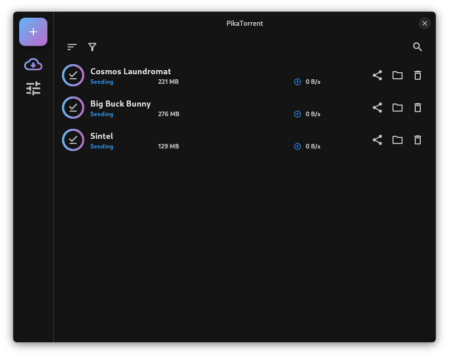

# PikaTorrent

Just pick a Torrent. Stream and download torrents on all your devices.

## Installation

To receive updates automatically and ensure the app handles links shares correctly, installation through app stores is recommended.

| Windows | Linux | MacOS | Android | iOS |
| -- | -- | -- | -- | -- |
| [Microsoft Store](https://apps.microsoft.com/detail/9n9gjq9bdjw3?mode=direct) | [Flathub](https://flathub.org/apps/com.pikatorrent.PikaTorrent) | - | [Play Store](https://play.google.com/store/apps/details?id=com.pikatorrent.PikaTorrent) | - |
| [.zip](https://github.com/G-Ray/pikatorrent/releases) | [.zip*](https://github.com/G-Ray/pikatorrent/releases) | [.zip (experimental)](https://github.com/G-Ray/pikatorrent/releases) | [.apk](https://github.com/G-Ray/pikatorrent/releases) | - |

The releases are currently considered beta. Features might changes and things could break. Please open issues to report bugs or features requests.

**\*** .zip for linux needs `mpv` to be installed on you OS. Other dependencies might be required.

## Screenshots

| Desktop                                                  | Mobile                                                 |
| -------------------------------------------------------- | ------------------------------------------------------ |
|  |  |
|    |    |

## Development

See [docs/development.md](./docs/development.md)

## Upgrade to >= v0.10.0

PikaTorrent has been rewritten from scratch for v0.10.0. If you already use a previous release, upgrading to v0.10.0 will most likely not display your previous torrents.

If you want to migrate your torrents :

- Windows: Copy `%APPDATA%\pikatorrent\Config\transmission` to `%APPDATA%\pikatorrent\com.pikatorrent\PikaTorrent`)
- Linux: Copy `~/.config/pikatorrent/transmission` to `~/.local/share/pikatorrent/transmission`)

After that, It's probably safe to remove these folders :

- Windows: `%APPDATA%\pikatorrent`
- Linux: `~/.config/pikatorrent`

## Localization

PikaTorrent will soon be available in multiple languages. You will be able to contribute through weblate.

## License

GPL-3.0
